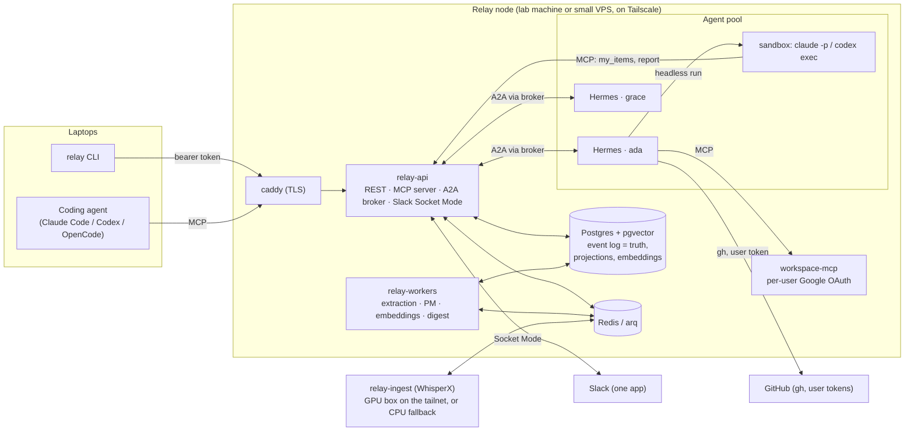

# Relay

**Relay connects your coding agent to your team's meetings and chat.** A meeting becomes decisions and action items with provenance. Each item reaches the assignee's own agent, which already knows what the team decided and what is assigned to its human. What the agent does flows back as reports, standups, and approvals the team sees in Slack. Nobody pastes context in either direction.

Relay is the shared memory and switchboard *underneath* the agents people already use: Claude Code, Codex, OpenCode, Hermes, or anything that speaks MCP and A2A. It is **not** an agent framework. It runs no model calls on your behalf, holds no private memory, and asks your agent for anything that needs your credentials. It is also not a replacement for Slackbot, Claude in Slack, or Codex in Slack; those are executors, Relay is the record and the broker beneath them, and it works on a free or Pro Slack plan ([ADR-0009](docs/adr/0009-relay-under-vendor-agents.md)).

## 60-second quickstart

```bash
git clone https://github.com/relayagents/relay && cd relay
./scripts/bootstrap.sh            # writes .env with generated secrets
$EDITOR .env                      # hostname, Slack tokens, team model key (optional)
./scripts/bootstrap.sh            # docker compose up -d --build, waits for /health, creates the admin
uv tool install git+https://github.com/relayagents/relay   # the `relay` CLI on your laptop (PyPI release pending)
relay login --url https://relay.example.dev --token <printed above>
scripts/add-user.sh grace         # on the node: user, tokens, AgentCard, and a Hermes container
relay setup-agent claude-code     # points your coding agent at Relay's MCP server
relay meeting upload --transcript fixtures/transcript_sample.json --skip-asr --participants ada,grace,linus
relay my-items                    # ...and `relay recall "embedding cache"`, `relay decisions`
```

No Docker on hand? `RELAY_DATABASE_URL=sqlite+aiosqlite:///relay.db RELAY_ENVIRONMENT=test uv run relay serve` runs the API alone for a look around, and `uv run pytest -q` runs the whole suite on SQLite.

## How it fits together



## The tool surface

The same nine operations exist as MCP tools, `relay` subcommands, and `POST /v1/tools/<name>`, generated from one definition ([src/relayagents/tools/registry.py](src/relayagents/tools/registry.py)) so they cannot drift.

| Operation | Purpose |
|---|---|
| `recall <query>` | hybrid search over team memory (event log + pgvector; graph optional) with provenance and links |
| `my_items` / `items --assignee` | open action items, with source meeting and status |
| `events --since --type --thread` | query the event log |
| `report <text> [--item-id ID] [--link URL]` | publish what I did as an event (source for standups and item closure) |
| `ask <user> <question>` | A2A message to a teammate's agent, threaded, surfaced to that human in Slack |
| `request_approval <action>` | open an approval; blocks until the human resolves it in Slack |
| `decisions --topic` | decisions with dates and superseded-by links |
| `post <text>` | post to Slack via Relay's app with "posted by X's agent" attribution |

## Principles

1. **The event log is the source of truth.** Projections, embeddings, digests: all derived, all rebuildable with `relay replay`. A knowledge graph is optional, and off by default ([ADR-0005](docs/adr/0005-team-memory-without-a-graph.md)).
2. **Relay holds team memory only.** Private memory stays in your agent. Relay stores no LLM keys for users and proxies no model traffic; the one team model key lives in the workers.
3. **Delegated, per-user permission.** Agents act under their human's tokens. External writes are approval-gated by default and audit-logged always.
4. **Per-tool transport.** MCP for SaaS tools and Relay's own surface, CLI for local tooling and headless coding agents, A2A through Relay's broker for agent-to-agent.
5. **Pluggable everything**, one reference implementation each.
6. **One compose file runs it.**
7. **Anything that would surprise a human later is surfaced to that human.**
8. **Public from commit one.** Synthetic fixtures only.

## Start here if you're new

1. [`CLAUDE.md`](CLAUDE.md): the non-negotiables, the dev loop, and how we work. Coding agents read it automatically; read it yourself first.
2. [`CONTRIBUTING.md`](CONTRIBUTING.md): the PR workflow and etiquette.
3. [docs/architecture.md](docs/architecture.md), [docs/data-model.md](docs/data-model.md), [docs/permissions.md](docs/permissions.md), [docs/protocols.md](docs/protocols.md), [docs/agent-contract.md](docs/agent-contract.md).
4. [docs/adr](docs/adr): why things are the way they are. Read 0001, 0002, 0005, and 0009 first.
5. [docs/roadmap.md](docs/roadmap.md): what's next, in order, and what's parked.

## Deliberately not in v1

- Live meeting bots (v1 accepts recordings and transcripts; live capture is v2).
- Microsoft 365 (the `OfficeSuite` protocol is there; Google Workspace is the reference).
- Multi-tenant hosting. One node is one team.
- Running Relay's own agents. Relay's PM function has no credentials and asks your agent instead.
- A knowledge graph, by default (see above).

## Status

Pre-alpha. Both vertical slices (meeting → action → code, and daily updates on behalf of each teammate) are wired end to end and covered by about a hundred tests on SQLite; the compose stack targets Postgres + pgvector and has been validated by CI but not yet booted for real. The Hermes image needs alignment before that first boot; see the [roadmap](docs/roadmap.md).

## Contributing

See [CONTRIBUTING.md](CONTRIBUTING.md). Apache-2.0.

---

From the [Agentic Learning AI Lab](https://github.com/agentic-learning-ai-lab).
